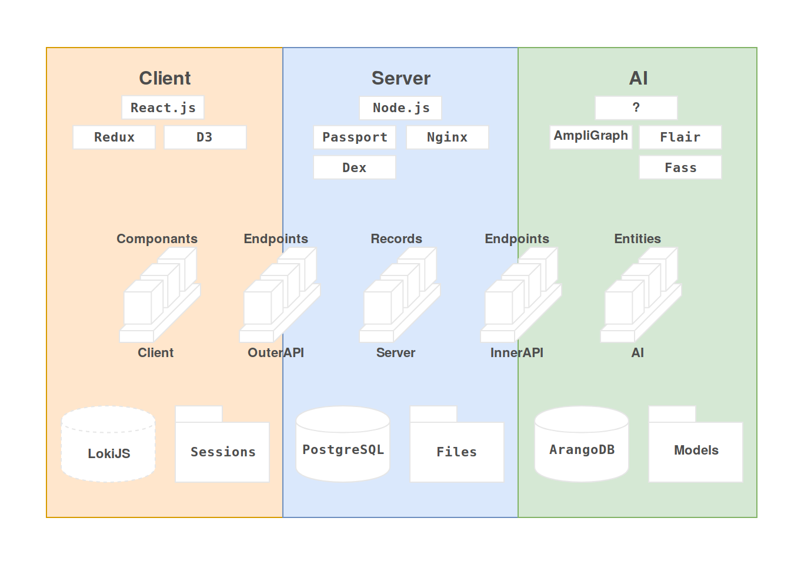

# fluxcell

fluxcell is a bot, messaging platform, database and search engine rolled into one. Its designed to support sustainable self-organization, by helping you share, tag and query your data, and tune where and how it is stored, transformed and modeled. Importantly, fluxcell strives towards a powerful and security minded role-based access control system to help individuals, communities and organizations regulate access to data.

This is in early development, not really usable.

## Running

To run, use the `./fluxcell` CLI, with an optional `--dev` flag for hotloaded development mode.

This wraps docker-compose, so you can:

```bash
./fluxcell --dev up -d --build
```

To run a development build, which should only be rebuilt when dependencies change.

## Diagrams

Basic layout:  


Architecture Sketch:

